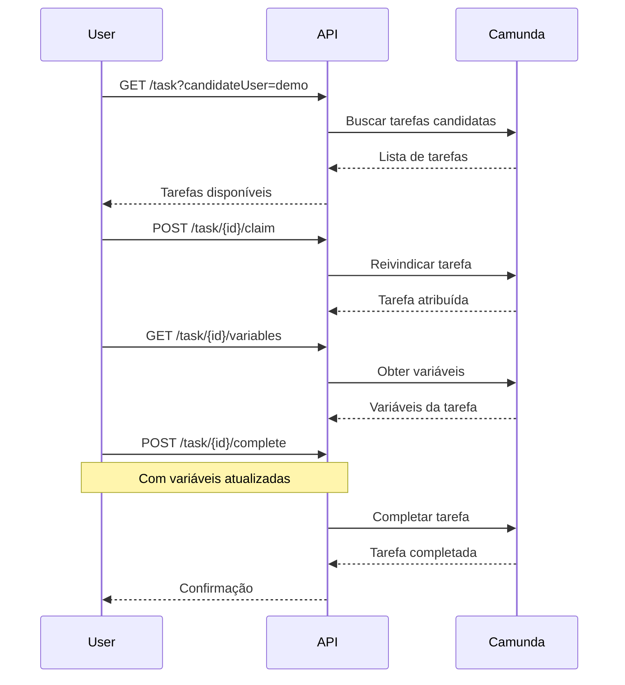
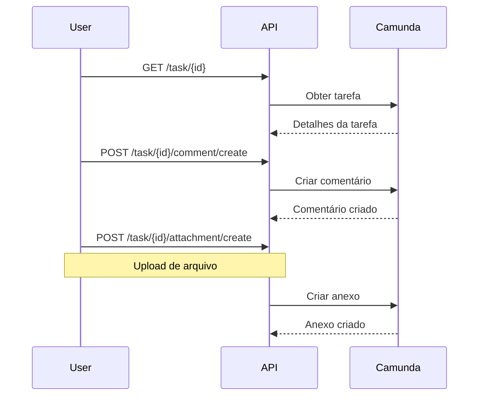

# 📋 Mapeamento de Funcionalidades - Camunda Tasklist e API REST

## 📖 Índice

1. [Visão Geral](#visão-geral)
2. [Funcionalidades da Tasklist](#funcionalidades-da-tasklist)
3. [APIs REST Correspondentes](#apis-rest-correspondentes)
4. [Estrutura de Dados](#estrutura-de-dados)
5. [Fluxos de Trabalho](#fluxos-de-trabalho)
6. [Exemplos Práticos](#exemplos-práticos)
7. [Autenticação](#autenticação)

---

## 🎯 Visão Geral

A **Tasklist** é a interface web do Camunda BPM que permite aos usuários visualizar, filtrar, atribuir e completar tarefas humanas (User Tasks) de processos de negócio.

Este documento mapeia cada funcionalidade visual da Tasklist para os endpoints correspondentes da **Camunda REST API**, permitindo que você integre essas funcionalidades em sistemas externos.

**Base URL da API**: `http://localhost:8080/engine-rest`

---

## 📱 Funcionalidades da Tasklist

### 1. **Listar Tarefas (Task List)**

#### Funcionalidade Visual
- Exibe lista de tarefas atribuídas ao usuário
- Mostra: ID da tarefa, nome, processo, data de criação, atribuído a, etc.
- Suporta paginação e ordenação

#### API REST Correspondente

```http
GET /task
```

**Query Parameters:**
- `assignee` - Filtrar por usuário atribuído
- `candidateUser` - Filtrar por usuário candidato
- `candidateGroup` - Filtrar por grupo candidato
- `processInstanceId` - Filtrar por instância de processo
- `processDefinitionKey` - Filtrar por chave da definição de processo
- `taskDefinitionKey` - Filtrar por chave da definição de tarefa
- `createdAfter` - Filtrar tarefas criadas após data
- `createdBefore` - Filtrar tarefas criadas antes de data
- `dueAfter` - Filtrar tarefas com vencimento após data
- `dueBefore` - Filtrar tarefas com vencimento antes de data
- `priority` - Filtrar por prioridade
- `active` - Apenas tarefas ativas (true/false)
- `completed` - Apenas tarefas completadas (true/false)
- `firstResult` - Primeiro resultado (paginação)
- `maxResults` - Máximo de resultados (paginação)
- `sortBy` - Campo para ordenação
- `sortOrder` - Ordem (asc/desc)

**Exemplo de Requisição:**
```bash
curl -X GET "http://localhost:8080/engine-rest/task?assignee=demo&active=true&firstResult=0&maxResults=10" 
```

**Resposta:**
```json
[
  {
    "id": "task-123",
    "name": "Aprovar Solicitação",
    "assignee": "demo",
    "created": "2025-11-17T10:00:00.000+0000",
    "due": "2025-11-20T10:00:00.000+0000",
    "followUp": null,
    "delegationState": null,
    "description": "Revisar e aprovar solicitação de férias",
    "executionId": "execution-456",
    "owner": null,
    "parentTaskId": null,
    "priority": 50,
    "processDefinitionId": "process-def-789",
    "processInstanceId": "process-instance-101",
    "caseDefinitionId": null,
    "caseInstanceId": null,
    "caseExecutionId": null,
    "taskDefinitionKey": "approve_request",
    "suspended": false,
    "formKey": "embedded:app:forms/approve-request.html",
    "tenantId": null
  }
]
```

---

### 2. **Buscar Tarefa por ID**

#### Funcionalidade Visual
- Ao clicar em uma tarefa, exibe detalhes completos
- Mostra informações da tarefa, variáveis, histórico, etc.

#### API REST Correspondente

```http
GET /task/{id}
```

**Exemplo:**
```bash
curl -X GET "http://localhost:8080/engine-rest/task/task-123" 
```

**Resposta:**
```json
{
  "id": "task-123",
  "name": "Aprovar Solicitação",
  "assignee": "demo",
  "created": "2025-11-17T10:00:00.000+0000",
  "due": "2025-11-20T10:00:00.000+0000",
  "followUp": null,
  "delegationState": null,
  "description": "Revisar e aprovar solicitação de férias",
  "executionId": "execution-456",
  "owner": null,
  "parentTaskId": null,
  "priority": 50,
  "processDefinitionId": "process-def-789",
  "processInstanceId": "process-instance-101",
  "caseDefinitionId": null,
  "caseInstanceId": null,
  "caseExecutionId": null,
  "taskDefinitionKey": "approve_request",
  "suspended": false,
  "formKey": "embedded:app:forms/approve-request.html",
  "tenantId": null
}
```

---

### 3. **Obter Variáveis da Tarefa**

#### Funcionalidade Visual
- Painel lateral mostrando variáveis do processo
- Permite visualizar valores de variáveis associadas à tarefa

#### API REST Correspondente

```http
GET /task/{id}/variables
GET /task/{id}/variables/{varName}
GET /task/{id}/variables/{varName}/data
```

**Exemplo:**
```bash
# Todas as variáveis
curl -X GET "http://localhost:8080/engine-rest/task/task-123/variables" 

# Variável específica
curl -X GET "http://localhost:8080/engine-rest/task/task-123/variables/requestId" 

# Dados binários de variável (se for arquivo)
curl -X GET "http://localhost:8080/engine-rest/task/task-123/variables/document/data" 
```

**Resposta:**
```json
{
  "requestId": {
    "type": "String",
    "value": "REQ-2025-001",
    "valueInfo": {}
  },
  "amount": {
    "type": "Double",
    "value": 1500.00,
    "valueInfo": {}
  },
  "approved": {
    "type": "Boolean",
    "value": false,
    "valueInfo": {}
  }
}
```

---

### 4. **Atribuir Tarefa**

#### Funcionalidade Visual
- Botão "Assign" na interface
- Permite atribuir tarefa a um usuário específico
- Remove de candidatos e atribui diretamente

#### API REST Correspondente

```http
POST /task/{id}/assignee
```

**Body:**
```json
{
  "userId": "demo"
}
```

**Exemplo:**
```bash
curl -X POST "http://localhost:8080/engine-rest/task/task-123/assignee" \
  -H "Content-Type: application/json"  \
  -d '{"userId": "demo"}'
```

**Resposta:**
```json
{
  "id": "task-123",
  "name": "Aprovar Solicitação",
  "assignee": "demo",
  ...
}
```

---

### 5. **Delegar Tarefa**

#### Funcionalidade Visual
- Botão "Delegate" na interface
- Permite delegar tarefa para outro usuário
- Mantém o delegador como owner

#### API REST Correspondente

```http
POST /task/{id}/delegate
```

**Body:**
```json
{
  "userId": "other-user"
}
```

**Exemplo:**
```bash
curl -X POST "http://localhost:8080/engine-rest/task/task-123/delegate" \
  -H "Content-Type: application/json"  \
  -d '{"userId": "other-user"}'
```

**Resposta:**
```json
{
  "id": "task-123",
  "name": "Aprovar Solicitação",
  "assignee": "other-user",
  "owner": "demo",
  "delegationState": "PENDING",
  ...
}
```

---

### 6. **Reivindicar Tarefa (Claim)**

#### Funcionalidade Visual
- Botão "Claim" em tarefas candidatas
- Permite que usuário reivindique tarefa de um grupo candidato
- Atribui tarefa ao usuário que reivindicou

#### API REST Correspondente

```http
POST /task/{id}/claim
```

**Body:**
```json
{
  "userId": "demo"
}
```

**Exemplo:**
```bash
curl -X POST "http://localhost:8080/engine-rest/task/task-123/claim" \
  -H "Content-Type: application/json"  \
  -d '{"userId": "demo"}'
```

**Resposta:**
```json
{
  "id": "task-123",
  "name": "Aprovar Solicitação",
  "assignee": "demo",
  ...
}
```

---

### 7. **Desatribuir Tarefa (Unclaim)**

#### Funcionalidade Visual
- Botão "Unclaim" em tarefas atribuídas
- Remove atribuição, retornando para grupo candidato

#### API REST Correspondente

```http
POST /task/{id}/unclaim
```

**Exemplo:**
```bash
curl -X POST "http://localhost:8080/engine-rest/task/task-123/unclaim" 
```

**Resposta:**
```json
{
  "id": "task-123",
  "name": "Aprovar Solicitação",
  "assignee": null,
  ...
}
```

---

### 8. **Completar Tarefa**

#### Funcionalidade Visual
- Botão "Complete" na interface
- Abre formulário (se houver formKey)
- Permite definir variáveis ao completar
- Avança o processo para próxima etapa

#### API REST Correspondente

```http
POST /task/{id}/complete
```

**Body:**
```json
{
  "variables": {
    "approved": {
      "value": true,
      "type": "Boolean"
    },
    "comments": {
      "value": "Aprovado após revisão",
      "type": "String"
    }
  },
  "withVariablesInReturn": true
}
```

**Exemplo:**
```bash
curl -X POST "http://localhost:8080/engine-rest/task/task-123/complete" \
  -H "Content-Type: application/json"  \
  -d '{
    "variables": {
      "approved": {"value": true, "type": "Boolean"},
      "comments": {"value": "Aprovado", "type": "String"}
    }
  }'
```

**Resposta:**
```json
{
  "id": "task-123",
  "name": "Aprovar Solicitação",
  "assignee": "demo",
  ...
}
```

---

### 9. **Atualizar Variáveis da Tarefa**

#### Funcionalidade Visual
- Edição de variáveis no painel lateral
- Salva alterações antes de completar

#### API REST Correspondente

```http
POST /task/{id}/variables
PUT /task/{id}/variables/{varName}
DELETE /task/{id}/variables/{varName}
```

**Exemplo - Criar/Atualizar variável:**
```bash
curl -X POST "http://localhost:8080/engine-rest/task/task-123/variables" \
  -H "Content-Type: application/json"  \
  -d '{
    "modifications": {
      "approved": {"value": true, "type": "Boolean"},
      "comments": {"value": "Revisado", "type": "String"}
    }
  }'
```

**Exemplo - Atualizar variável específica:**
```bash
curl -X PUT "http://localhost:8080/engine-rest/task/task-123/variables/approved" \
  -H "Content-Type: application/json"  \
  -d '{
    "value": true,
    "type": "Boolean"
  }'
```

**Exemplo - Deletar variável:**
```bash
curl -X DELETE "http://localhost:8080/engine-rest/task/task-123/variables/tempVar" 
```

---

### 10. **Definir Prioridade**

#### Funcionalidade Visual
- Campo de prioridade na interface
- Valores: 0-100 (maior = mais prioritário)

#### API REST Correspondente

```http
PUT /task/{id}/priority
```

**Body:**
```json
{
  "priority": 75
}
```

**Exemplo:**
```bash
curl -X PUT "http://localhost:8080/engine-rest/task/task-123/priority" \
  -H "Content-Type: application/json"  \
  -d '{"priority": 75}'
```

---

### 11. **Definir Data de Vencimento (Due Date)**

#### Funcionalidade Visual
- Campo de data de vencimento
- Calendário para seleção

#### API REST Correspondente

```http
PUT /task/{id}/due-date
```

**Body:**
```json
{
  "dueDate": "2025-11-20T10:00:00.000+0000"
}
```

**Exemplo:**
```bash
curl -X PUT "http://localhost:8080/engine-rest/task/task-123/due-date" \
  -H "Content-Type: application/json"  \
  -d '{"dueDate": "2025-11-20T10:00:00.000+0000"}'
```

---

### 12. **Definir Data de Follow-up**

#### Funcionalidade Visual
- Campo de data de follow-up
- Para lembrar de revisar tarefa

#### API REST Correspondente

```http
PUT /task/{id}/follow-up
```

**Body:**
```json
{
  "followUpDate": "2025-11-18T10:00:00.000+0000"
}
```

**Exemplo:**
```bash
curl -X PUT "http://localhost:8080/engine-rest/task/task-123/follow-up" \
  -H "Content-Type: application/json"  \
  -d '{"followUpDate": "2025-11-18T10:00:00.000+0000"}'
```

---

### 13. **Obter Comentários (Comments)**

#### Funcionalidade Visual
- Seção de comentários na tarefa
- Histórico de comentários adicionados

#### API REST Correspondente

```http
GET /task/{id}/comment
GET /task/{id}/comment/{commentId}
```

**Exemplo:**
```bash
# Listar comentários
curl -X GET "http://localhost:8080/engine-rest/task/task-123/comment" 

# Obter comentário específico
curl -X GET "http://localhost:8080/engine-rest/task/task-123/comment/comment-456" 
```

**Resposta:**
```json
[
  {
    "id": "comment-456",
    "userId": "demo",
    "taskId": "task-123",
    "processInstanceId": "process-instance-101",
    "time": "2025-11-17T10:30:00.000+0000",
    "message": "Preciso revisar os documentos anexos",
    "removalTime": null,
    "rootProcessInstanceId": "process-instance-101"
  }
]
```

---

### 14. **Adicionar Comentário**

#### Funcionalidade Visual
- Campo de texto para adicionar comentário
- Botão "Add Comment"

#### API REST Correspondente

```http
POST /task/{id}/comment/create
```

**Body:**
```json
{
  "userId": "demo",
  "message": "Preciso revisar os documentos anexos"
}
```

**Exemplo:**
```bash
curl -X POST "http://localhost:8080/engine-rest/task/task-123/comment/create" \
  -H "Content-Type: application/json"  \
  -d '{
    "userId": "demo",
    "message": "Preciso revisar os documentos anexos"
  }'
```

**Resposta:**
```json
{
  "id": "comment-456",
  "userId": "demo",
  "taskId": "task-123",
  "processInstanceId": "process-instance-101",
  "time": "2025-11-17T10:30:00.000+0000",
  "message": "Preciso revisar os documentos anexos",
  "removalTime": null,
  "rootProcessInstanceId": "process-instance-101"
}
```

---

### 15. **Obter Anexos (Attachments)**

#### Funcionalidade Visual
- Seção de anexos na tarefa
- Lista de arquivos anexados
- Botão para download

#### API REST Correspondente

```http
GET /task/{id}/attachment
GET /task/{id}/attachment/{attachmentId}
GET /task/{id}/attachment/{attachmentId}/data
```

**Exemplo:**
```bash
# Listar anexos
curl -X GET "http://localhost:8080/engine-rest/task/task-123/attachment" 

# Obter anexo específico
curl -X GET "http://localhost:8080/engine-rest/task/task-123/attachment/attach-789" 

# Download do arquivo
curl -X GET "http://localhost:8080/engine-rest/task/task-123/attachment/attach-789/data"  \
  -o documento.pdf
```

**Resposta:**
```json
[
  {
    "id": "attach-789",
    "name": "documento.pdf",
    "taskId": "task-123",
    "processInstanceId": "process-instance-101",
    "type": "application/pdf",
    "url": "/engine-rest/task/task-123/attachment/attach-789/data",
    "createTime": "2025-11-17T10:00:00.000+0000",
    "removalTime": null,
    "rootProcessInstanceId": "process-instance-101",
    "description": "Documento de aprovação"
  }
]
```

---

### 16. **Adicionar Anexo**

#### Funcionalidade Visual
- Botão "Add Attachment"
- Upload de arquivo
- Campo de descrição

#### API REST Correspondente

```http
POST /task/{id}/attachment/create
```

**Body (multipart/form-data):**
- `attachment-name`: Nome do anexo
- `attachment-description`: Descrição
- `attachment-type`: Tipo MIME
- `url`: URL do arquivo (opcional)
- `content`: Conteúdo binário do arquivo

**Exemplo:**
```bash
curl -X POST "http://localhost:8080/engine-rest/task/task-123/attachment/create"  \
  -F "attachment-name=documento.pdf" \
  -F "attachment-description=Documento de aprovação" \
  -F "attachment-type=application/pdf" \
  -F "content=@/path/to/documento.pdf"
```

---

### 17. **Obter Histórico da Tarefa**

#### Funcionalidade Visual
- Aba "History" na interface
- Mostra eventos históricos da tarefa

#### API REST Correspondente

```http
GET /history/task
GET /history/task/{id}
```

**Exemplo:**
```bash
# Listar tarefas históricas
curl -X GET "http://localhost:8080/engine-rest/history/task?processInstanceId=process-instance-101" 

# Obter tarefa histórica específica
curl -X GET "http://localhost:8080/engine-rest/history/task/task-123" 
```

**Resposta:**
```json
[
  {
    "id": "task-123",
    "processDefinitionKey": "approval-process",
    "processDefinitionId": "process-def-789",
    "processInstanceId": "process-instance-101",
    "executionId": "execution-456",
    "caseDefinitionKey": null,
    "caseDefinitionId": null,
    "caseInstanceId": null,
    "caseExecutionId": null,
    "activityInstanceId": "activity-instance-789",
    "name": "Aprovar Solicitação",
    "description": null,
    "deleteReason": "completed",
    "owner": null,
    "assignee": "demo",
    "startTime": "2025-11-17T10:00:00.000+0000",
    "endTime": "2025-11-17T11:00:00.000+0000",
    "duration": 3600000,
    "taskDefinitionKey": "approve_request",
    "priority": 50,
    "dueDate": "2025-11-20T10:00:00.000+0000",
    "followUpDate": null,
    "parentTaskId": null,
    "tenantId": null,
    "removalTime": null,
    "rootProcessInstanceId": "process-instance-101"
  }
]
```

---

### 18. **Obter Informações do Processo**

#### Funcionalidade Visual
- Link para processo relacionado
- Mostra definição e instância do processo

#### API REST Correspondente

```http
GET /process-definition/{id}
GET /process-instance/{id}
GET /process-instance/{id}/variables
```

**Exemplo:**
```bash
# Definição do processo
curl -X GET "http://localhost:8080/engine-rest/process-definition/process-def-789" 

# Instância do processo
curl -X GET "http://localhost:8080/engine-rest/process-instance/process-instance-101" 

# Variáveis do processo
curl -X GET "http://localhost:8080/engine-rest/process-instance/process-instance-101/variables" 
```

---

### 19. **Filtros e Busca**

#### Funcionalidade Visual
- Barra de busca
- Filtros por: atribuído, grupo, processo, data, etc.
- Ordenação por colunas

#### API REST Correspondente

Usa os mesmos endpoints de listagem com query parameters:

```http
GET /task?assignee=demo&processDefinitionKey=approval-process&createdAfter=2025-11-01T00:00:00.000+0000&sortBy=created&sortOrder=desc
```

**Exemplo:**
```bash
curl -X GET "http://localhost:8080/engine-rest/task?assignee=demo&active=true&processDefinitionKey=approval-process&sortBy=created&sortOrder=desc&firstResult=0&maxResults=20" 
```

---

### 20. **Contagem de Tarefas**

#### Funcionalidade Visual
- Contador de tarefas no cabeçalho
- Mostra total de tarefas pendentes

#### API REST Correspondente

```http
GET /task/count
```

**Exemplo:**
```bash
curl -X GET "http://localhost:8080/engine-rest/task/count?assignee=demo&active=true" 
```

**Resposta:**
```json
{
  "count": 15
}
```

---

## 📊 Estrutura de Dados

### Objeto Task (Tarefa)

```json
{
  "id": "string",                    // ID único da tarefa
  "name": "string",                  // Nome da tarefa
  "assignee": "string",              // Usuário atribuído (null se não atribuída)
  "created": "datetime",             // Data de criação
  "due": "datetime",                 // Data de vencimento (null se não definida)
  "followUp": "datetime",            // Data de follow-up (null se não definida)
  "delegationState": "string",       // Estado de delegação: PENDING, RESOLVED, null
  "description": "string",           // Descrição da tarefa
  "executionId": "string",           // ID da execução
  "owner": "string",                 // Proprietário (quem delegou)
  "parentTaskId": "string",          // ID da tarefa pai (null se não houver)
  "priority": "integer",             // Prioridade (0-100)
  "processDefinitionId": "string",   // ID da definição de processo
  "processInstanceId": "string",    // ID da instância de processo
  "caseDefinitionId": "string",     // ID da definição de caso (null se não for caso)
  "caseInstanceId": "string",        // ID da instância de caso (null se não for caso)
  "caseExecutionId": "string",      // ID da execução de caso (null se não for caso)
  "taskDefinitionKey": "string",    // Chave da definição de tarefa (do BPMN)
  "suspended": "boolean",            // Se a tarefa está suspensa
  "formKey": "string",               // Chave do formulário (null se não houver)
  "tenantId": "string"               // ID do tenant (null se não houver multi-tenancy)
}
```

### Objeto Variable (Variável)

```json
{
  "value": "any",                    // Valor da variável
  "type": "string",                  // Tipo: String, Integer, Long, Double, Boolean, Date, Json, Xml, File
  "valueInfo": {                     // Informações adicionais sobre o valor
    "objectTypeName": "string",      // Para objetos serializados
    "serializationDataFormat": "string", // Formato de serialização
    "filename": "string",            // Para variáveis do tipo File
    "mimeType": "string"            // Para variáveis do tipo File
  }
}
```

### Objeto Comment (Comentário)

```json
{
  "id": "string",                    // ID único do comentário
  "userId": "string",                // Usuário que criou o comentário
  "taskId": "string",                // ID da tarefa
  "processInstanceId": "string",    // ID da instância de processo
  "time": "datetime",                // Data/hora do comentário
  "message": "string",               // Mensagem do comentário
  "removalTime": "datetime",        // Data de remoção (null se não removido)
  "rootProcessInstanceId": "string" // ID da instância raiz do processo
}
```

### Objeto Attachment (Anexo)

```json
{
  "id": "string",                    // ID único do anexo
  "name": "string",                  // Nome do arquivo
  "taskId": "string",                // ID da tarefa
  "processInstanceId": "string",     // ID da instância de processo
  "type": "string",                  // Tipo MIME
  "url": "string",                   // URL para download
  "createTime": "datetime",          // Data de criação
  "removalTime": "datetime",        // Data de remoção (null se não removido)
  "rootProcessInstanceId": "string", // ID da instância raiz do processo
  "description": "string"            // Descrição do anexo
}
```

---

## 🔄 Fluxos de Trabalho

### Fluxo 1: Reivindicar e Completar Tarefa



### Fluxo 2: Adicionar Comentário e Anexo



---

## 💡 Exemplos Práticos

### Exemplo 1: Listar Tarefas Pendentes do Usuário

```python
import requests
from requests.auth import HTTPBasicAuth

CAMUNDA_URL = "http://localhost:8080/engine-rest"
USERNAME = "demo"
PASSWORD = "demo"

# Listar tarefas atribuídas ao usuário
response = requests.get(
    f"{CAMUNDA_URL}/task",
    params={
        "assignee": USERNAME,
        "active": "true",
        "sortBy": "created",
        "sortOrder": "desc",
        "firstResult": 0,
        "maxResults": 20
    },
    auth=HTTPBasicAuth(USERNAME, PASSWORD)
)

tasks = response.json()
print(f"Total de tarefas: {len(tasks)}")
for task in tasks:
    print(f"- {task['name']} (ID: {task['id']})")
```

### Exemplo 2: Reivindicar e Completar Tarefa

```python
import requests
from requests.auth import HTTPBasicAuth

CAMUNDA_URL = "http://localhost:8080/engine-rest"
USERNAME = "demo"
PASSWORD = "demo"
TASK_ID = "task-123"

auth = HTTPBasicAuth(USERNAME, PASSWORD)

# 1. Reivindicar tarefa
response = requests.post(
    f"{CAMUNDA_URL}/task/{TASK_ID}/claim",
    json={"userId": USERNAME},
    auth=auth
)

# 2. Obter variáveis
response = requests.get(
    f"{CAMUNDA_URL}/task/{TASK_ID}/variables",
    auth=auth
)
variables = response.json()

# 3. Completar tarefa com variáveis atualizadas
response = requests.post(
    f"{CAMUNDA_URL}/task/{TASK_ID}/complete",
    json={
        "variables": {
            "approved": {"value": True, "type": "Boolean"},
            "comments": {"value": "Aprovado via API", "type": "String"}
        }
    },
    auth=auth
)

print("Tarefa completada com sucesso!")
```

### Exemplo 3: Adicionar Comentário e Anexo

```python
import requests
from requests.auth import HTTPBasicAuth

CAMUNDA_URL = "http://localhost:8080/engine-rest"
USERNAME = "demo"
PASSWORD = "demo"
TASK_ID = "task-123"

auth = HTTPBasicAuth(USERNAME, PASSWORD)

# 1. Adicionar comentário
response = requests.post(
    f"{CAMUNDA_URL}/task/{TASK_ID}/comment/create",
    json={
        "userId": USERNAME,
        "message": "Documentos revisados e aprovados"
    },
    auth=auth
)
comment = response.json()
print(f"Comentário criado: {comment['id']}")

# 2. Adicionar anexo
with open("documento.pdf", "rb") as f:
    files = {"content": f}
    data = {
        "attachment-name": "documento.pdf",
        "attachment-description": "Documento de aprovação",
        "attachment-type": "application/pdf"
    }
    response = requests.post(
        f"{CAMUNDA_URL}/task/{TASK_ID}/attachment/create",
        files=files,
        data=data,
        auth=auth
    )
    attachment = response.json()
    print(f"Anexo criado: {attachment['id']}")
```

### Exemplo 4: Filtrar Tarefas por Processo e Data

```python
import requests
from requests.auth import HTTPBasicAuth
from datetime import datetime, timedelta

CAMUNDA_URL = "http://localhost:8080/engine-rest"
USERNAME = "demo"
PASSWORD = "demo"

# Tarefas criadas nos últimos 7 dias
seven_days_ago = (datetime.now() - timedelta(days=7)).isoformat() + "Z"

response = requests.get(
    f"{CAMUNDA_URL}/task",
    params={
        "processDefinitionKey": "approval-process",
        "createdAfter": seven_days_ago,
        "active": "true",
        "sortBy": "created",
        "sortOrder": "desc"
    },
    auth=HTTPBasicAuth(USERNAME, PASSWORD)
)

tasks = response.json()
print(f"Tarefas do processo 'approval-process' criadas nos últimos 7 dias: {len(tasks)}")
```

---

## 🔐 Autenticação

A Camunda REST API suporta autenticação básica HTTP (Basic Auth).

### Headers Necessários

```http
Authorization: Basic <base64(username:password)>
```

### Exemplo com cURL

```bash
curl -u demo:demo http://localhost:8080/engine-rest/task
```

### Exemplo com Python

```python
import requests
from requests.auth import HTTPBasicAuth

response = requests.get(
    "http://localhost:8080/engine-rest/task",
    auth=HTTPBasicAuth("demo", "demo")
)
```

### Exemplo com JavaScript (fetch)

```javascript
const username = 'demo';
const password = 'demo';
const credentials = btoa(`${username}:${password}`);

fetch('http://localhost:8080/engine-rest/task', {
  headers: {
    'Authorization': `Basic ${credentials}`
  }
})
  .then(response => response.json())
  .then(tasks => console.log(tasks));
```

---

## 📚 Recursos Adicionais

### Documentação Oficial

- **Camunda REST API**: https://docs.camunda.org/manual/7.23/reference/rest/
- **Task API**: https://docs.camunda.org/manual/7.23/reference/rest/task/
- **History API**: https://docs.camunda.org/manual/7.23/reference/rest/history/

### Endpoints Relacionados

- **Process Definition API**: `/process-definition`
- **Process Instance API**: `/process-instance`
- **Execution API**: `/execution`
- **History API**: `/history`
- **Identity API**: `/identity`
- **Authorization API**: `/authorization`

### Testando a API

Você pode usar o arquivo `camunda.http` na raiz do projeto ou ferramentas como:
- **Postman**
- **Insomnia**
- **cURL**
- **Swagger UI** (se disponível)

---

## ✅ Checklist de Integração

Ao integrar a Tasklist em outro sistema, certifique-se de implementar:

- [ ] Autenticação básica HTTP
- [ ] Listagem de tarefas com filtros
- [ ] Reivindicação de tarefas (claim)
- [ ] Visualização de variáveis
- [ ] Atualização de variáveis
- [ ] Completar tarefa
- [ ] Gerenciamento de comentários
- [ ] Gerenciamento de anexos
- [ ] Tratamento de erros HTTP
- [ ] Paginação de resultados
- [ ] Cache de dados (opcional)
- [ ] Notificações em tempo real (opcional)

---

**Última atualização**: 2025-11-17  
**Versão do Camunda**: 7.23.0

